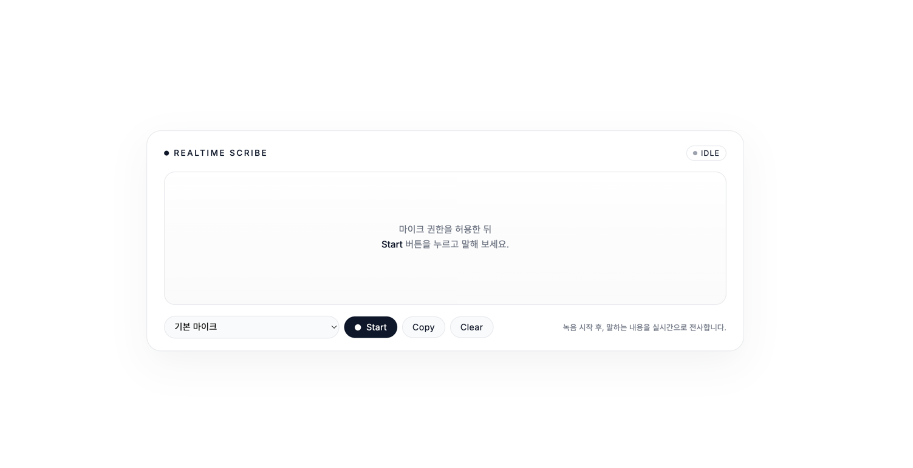

# Realtime Speech to Text

ElevenLabs Scribe v2 Realtime을 활용한 실시간 음성 인식 웹 애플리케이션입니다. 마이크 입력을 실시간으로 텍스트로 변환하며, 화자 구분 기능을 지원합니다.



## 주요 기능

- **실시간 음성 인식**: 말하는 즉시 텍스트로 변환
- **초저지연 전사**: 밀리초 단위의 빠른 응답 속도
- **깔끔한 UI**: 미니멀한 디자인으로 직관적인 사용자 경험
- **모바일 최적화**: 모바일에서도 손쉽게 사용 가능

## 기술 스택

- **Backend**: FastAPI (Python)
- **Frontend**: Vanilla JavaScript
- **API**: ElevenLabs Scribe v2 Realtime (WebSocket)
- **Audio**: Web Audio API

## 설치 및 실행

### 1. 요구사항

- Python 3.8 이상
- ElevenLabs API 키

### 2. 의존성 설치

```bash
pip install fastapi uvicorn python-dotenv httpx
```

### 3. 환경 변수 설정

프로젝트 루트에 `.env` 파일을 생성하고 다음 내용을 입력합니다:

```env
ELEVENLABS_API_KEY=your_api_key_here
BASIC_AUTH_USERNAME=admin
BASIC_AUTH_PASSWORD=your_secure_password
```

**ElevenLabs API 키 발급 방법:**
1. [ElevenLabs](https://elevenlabs.io)에 가입
2. 대시보드에서 API Keys 섹션으로 이동
3. 새 API 키 생성

### 4. 서버 실행

```bash
uvicorn main:app --reload
```

기본적으로 `http://localhost:8000`에서 서버가 실행됩니다.

### 5. 접속

브라우저에서 `http://localhost:8000`으로 접속합니다.

- Username: `.env` 파일에 설정한 `BASIC_AUTH_USERNAME`
- Password: `.env` 파일에 설정한 `BASIC_AUTH_PASSWORD`

## 사용 방법

1. **마이크 권한 허용**: 브라우저에서 마이크 접근 권한을 허용합니다.
2. **Start 버튼 클릭**: 녹음을 시작합니다.
3. **말하기**: 말하는 내용이 실시간으로 화면에 텍스트로 표시됩니다.
4. **Stop 버튼 클릭**: 녹음을 중지합니다.
5. **Copy 버튼**: 전사된 텍스트를 클립보드에 복사합니다.
6. **Clear 버튼**: 화면에 표시된 텍스트를 지웁니다.

## 프로젝트 구조

```
.
├── main.py                 # FastAPI 백엔드 서버
├── static/
│   └── index.html         # 프론트엔드 UI
├── .env                   # 환경 변수 (직접 생성 필요)
└── README.md
```

## API 엔드포인트

- `GET /`: 메인 페이지 (Basic Auth 필요)
- `GET /health`: 헬스 체크
- `GET /scribe-token`: ElevenLabs single-use token 발급 (Basic Auth 필요)

## 보안

- Basic Authentication을 통한 접근 제어
- API 키는 서버 측에서만 관리되며 클라이언트에 노출되지 않음
- Single-use token 방식으로 안전한 WebSocket 연결

## ElevenLabs Scribe v2 Realtime 정보

이 프로젝트는 ElevenLabs의 Scribe v2 Realtime 모델을 사용합니다:

- **모델**: `scribe_v2_realtime`
- **오디오 포맷**: PCM 16kHz
- **연결 방식**: WebSocket
- **주요 기능**:
  - 초저지연 실시간 전사
  - 음성 활동 감지(VAD) 기반 자동 세그먼트 분할
  - 단어 단위 타임스탬프
  - 화자 구분 (Diarization)

자세한 정보는 [ElevenLabs 공식 문서](https://elevenlabs.io/docs/cookbooks/speech-to-text/streaming)를 참조하세요.

## 라이선스

MIT

## 문의

문제가 발생하거나 질문이 있으시면 이슈를 등록해 주세요.
